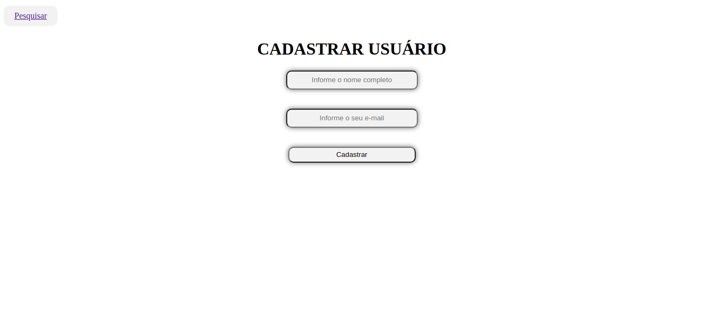

<h2 align="center">
  SISTEMA DE CADASTRO DE USUÁRIOS
</h2>

<h4 align="center">
  Sistema básico de cadastro de usuários com o intuito de desenvolver a lógica de programação.
</h4>



---

## Banco de dados
Crie um banco de dados e execute as instruções SQLs abaixo para criar a tabela `usuários`:

```
  CREATE TABLE usuarios (
	id smallint unsigned auto_increment,
    nome varchar(120) not null,
    email varchar(120) not null,
    created datetime not null,
    modified datetime default null,
    primary key (id)
) 
```
---

## Seções
O projeto é composto por 4 seções:

- **Home:** Cadastro de usuários;
- **Search:** Formulario para pesquisar a lista de usuários já cadastrados;
- **List:** Lista de usuários com os campos nome, email, data e horario de criação do cadastro;
- **Edition:** Formulario para edição de cadastro;

---

## Tecnologias e ferrametas utilizadas
Para o desenvolvimento deste projeto utilizei:

- PHP 8.0.12;
- MySQL 5.7;
- Sublime Text 3;
